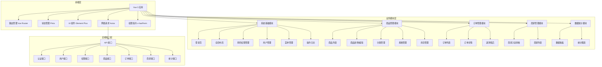
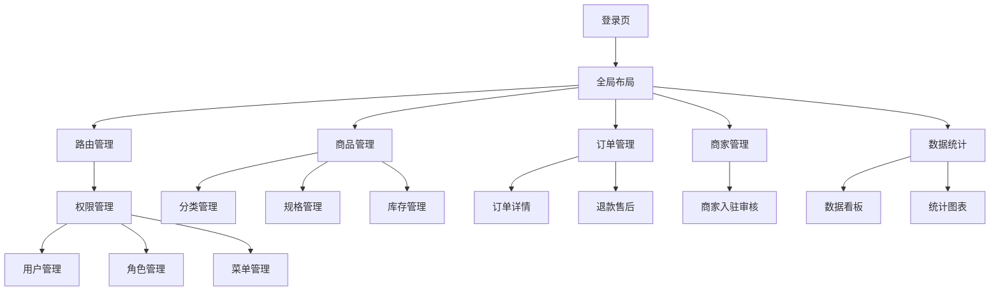
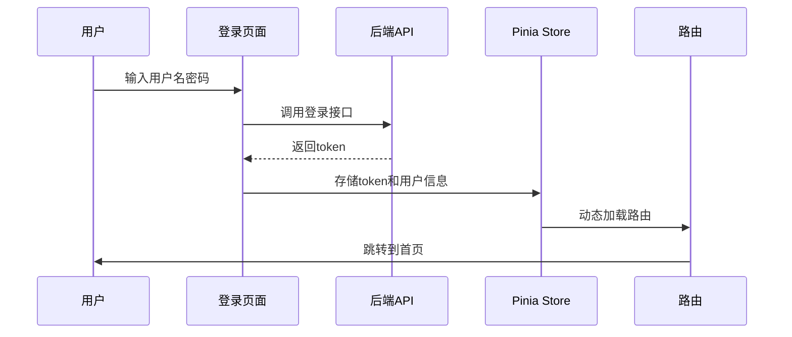
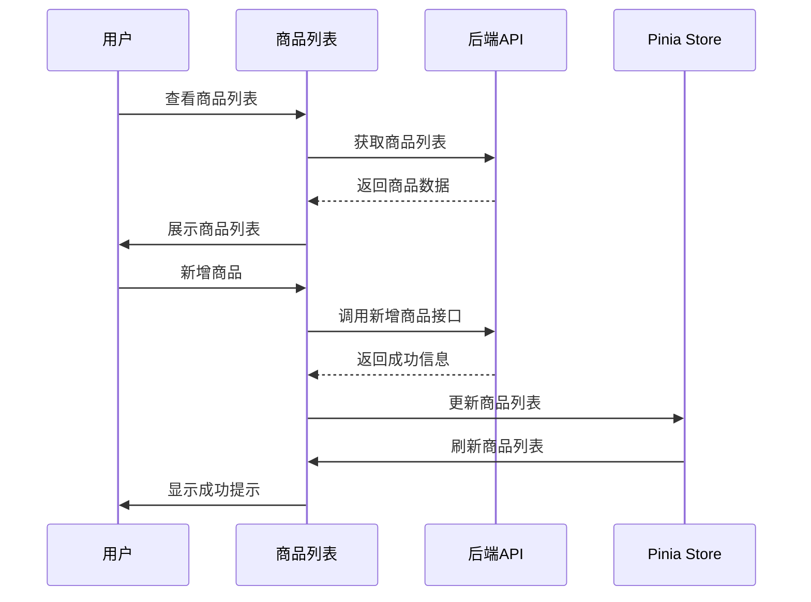
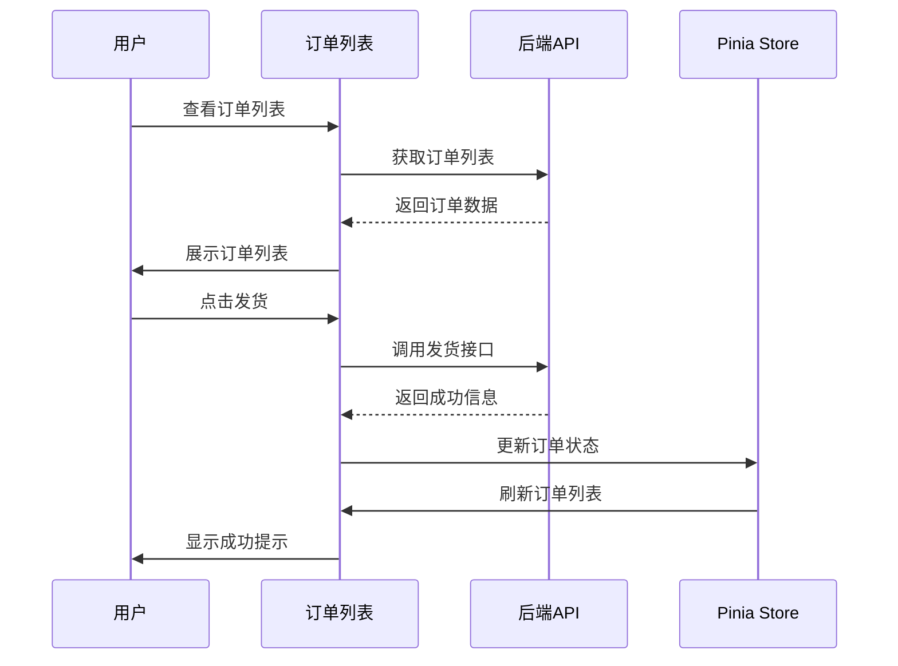

# 多角色多平台电商管理系统架构设计文档

## 一、整体架构图

## 二、系统分层设计与核心组件定义

### 2.1 系统分层
1. **前端层**：负责用户界面渲染和交互逻辑
2. **业务模块层**：实现具体的业务功能
3. **后端接口层**：提供 API 接口，与后端服务交互

### 2.2 核心组件
1. **Layout 组件**：全局布局组件，包含侧边栏、头部和内容区域
2. **Login 组件**：登录页面，处理用户登录逻辑
3. **Router**：路由配置，实现动态路由加载和权限控制
4. **Store**：状态管理，包含用户、权限和应用状态
5. **Axios 封装**：网络请求封装，处理鉴权、错误提示等
6. **Permission 指令**：权限控制指令，控制按钮级别的权限

## 三、模块依赖关系图

## 四、接口契约完整定义

### 4.1 认证接口
- **登录接口**
  - 请求方式：POST
  - 请求路径：/api/login
  - 请求参数：{
    "username": "string",
    "password": "string"
  }
  - 响应数据：{
    "code": 200,
    "message": "登录成功",
    "token": "string"
  }

- **获取用户信息接口**
  - 请求方式：GET
  - 请求路径：/api/user/info
  - 请求参数：无
  - 响应数据：{
    "code": 200,
    "message": "获取成功",
    "id": 1,
    "username": "string",
    "name": "string",
    "email": "string",
    "phone": "string",
    "roles": ["string"],
    "avatar": "string",
    "tenantId": 1,
    "tenantName": "string"
  }

- **退出登录接口**
  - 请求方式：POST
  - 请求路径：/api/logout
  - 请求参数：无
  - 响应数据：{
    "code": 200,
    "message": "退出成功"
  }

### 4.2 用户接口
- **获取用户列表**
  - 请求方式：GET
  - 请求路径：/api/user/list
  - 请求参数：{
    "page": 1,
    "pageSize": 10,
    "username": "string",
    "name": "string",
    "role": "string"
  }
  - 响应数据：{
    "code": 200,
    "message": "获取成功",
    "data": {
      "list": [{
        "id": 1,
        "username": "string",
        "name": "string",
        "email": "string",
        "phone": "string",
        "roles": ["string"],
        "createTime": "string"
      }],
      "total": 100
    }
  }

- **新增用户**
  - 请求方式：POST
  - 请求路径：/api/user/add
  - 请求参数：{
    "username": "string",
    "name": "string",
    "password": "string",
    "email": "string",
    "phone": "string",
    "roles": ["string"]
  }
  - 响应数据：{
    "code": 200,
    "message": "新增成功"
  }

- **编辑用户**
  - 请求方式：PUT
  - 请求路径：/api/user/edit
  - 请求参数：{
    "id": 1,
    "username": "string",
    "name": "string",
    "email": "string",
    "phone": "string",
    "roles": ["string"]
  }
  - 响应数据：{
    "code": 200,
    "message": "编辑成功"
  }

- **删除用户**
  - 请求方式：DELETE
  - 请求路径：/api/user/delete
  - 请求参数：{
    "id": 1
  }
  - 响应数据：{
    "code": 200,
    "message": "删除成功"
  }

### 4.3 商品接口
- **获取商品列表**
  - 请求方式：GET
  - 请求路径：/api/product/list
  - 请求参数：{
    "page": 1,
    "pageSize": 10,
    "name": "string",
    "categoryId": "string",
    "status": "string"
  }
  - 响应数据：{
    "code": 200,
    "message": "获取成功",
    "data": {
      "list": [{
        "id": 1,
        "name": "string",
        "categoryName": "string",
        "price": "string",
        "stock": 100,
        "status": 1,
        "createTime": "string"
      }],
      "total": 100
    }
  }

- **新增商品**
  - 请求方式：POST
  - 请求路径：/api/product/add
  - 请求参数：{
    "name": "string",
    "categoryId": 1,
    "price": 100,
    "stock": 100,
    "status": 1,
    "description": "string"
  }
  - 响应数据：{
    "code": 200,
    "message": "新增成功"
  }

- **编辑商品**
  - 请求方式：PUT
  - 请求路径：/api/product/edit
  - 请求参数：{
    "id": 1,
    "name": "string",
    "categoryId": 1,
    "price": 100,
    "stock": 100,
    "status": 1,
    "description": "string"
  }
  - 响应数据：{
    "code": 200,
    "message": "编辑成功"
  }

- **删除商品**
  - 请求方式：DELETE
  - 请求路径：/api/product/delete
  - 请求参数：{
    "id": 1
  }
  - 响应数据：{
    "code": 200,
    "message": "删除成功"
  }

### 4.4 订单接口
- **获取订单列表**
  - 请求方式：GET
  - 请求路径：/api/order/list
  - 请求参数：{
    "page": 1,
    "pageSize": 10,
    "orderNo": "string",
    "customerName": "string",
    "status": "string",
    "startTime": "string",
    "endTime": "string"
  }
  - 响应数据：{
    "code": 200,
    "message": "获取成功",
    "data": {
      "list": [{
        "id": 1,
        "orderNo": "string",
        "customerName": "string",
        "amount": "string",
        "status": 1,
        "createTime": "string"
      }],
      "total": 100
    }
  }

- **获取订单详情**
  - 请求方式：GET
  - 请求路径：/api/order/detail
  - 请求参数：{
    "id": 1
  }
  - 响应数据：{
    "code": 200,
    "message": "获取成功",
    "data": {
      "id": 1,
      "orderNo": "string",
      "customerName": "string",
      "amount": "string",
      "status": 1,
      "createTime": "string",
      "items": [{
        "id": 1,
        "productName": "string",
        "quantity": 1,
        "price": "string"
      }]
    }
  }

- **发货**
  - 请求方式：PUT
  - 请求路径：/api/order/ship
  - 请求参数：{
    "id": 1,
    "expressNo": "string",
    "expressCompany": "string"
  }
  - 响应数据：{
    "code": 200,
    "message": "发货成功"
  }

- **取消订单**
  - 请求方式：PUT
  - 请求路径：/api/order/cancel
  - 请求参数：{
    "id": 1
  }
  - 响应数据：{
    "code": 200,
    "message": "取消成功"
  }

## 五、核心业务数据流向图

### 5.1 用户登录流程

### 5.2 商品管理流程

### 5.3 订单管理流程

## 六、全局异常处理策略、降级兜底方案

### 6.1 异常处理策略
1. **网络异常**：显示网络错误提示，引导用户检查网络连接
2. **API 异常**：根据错误码显示相应的错误提示
3. **权限异常**：跳转到登录页面或显示无权限提示
4. **数据异常**：显示数据加载失败提示，提供重试功能

### 6.2 降级兜底方案
1. **本地存储**：使用 localStorage 存储用户信息和权限信息，当 API 不可用时，使用本地数据
2. **默认数据**：当数据加载失败时，显示默认数据或空状态
3. **离线模式**：当网络不可用时，显示离线提示，提供基本的浏览功能

## 七、安全设计与合规适配方案

### 7.1 安全设计
1. **Token 鉴权**：使用 JWT token 进行身份认证
2. **权限控制**：基于角色的访问控制，实现菜单和按钮级别的权限管理
3. **XSS 防护**：使用 Element Plus 的表单组件，自动进行 XSS 防护
4. **CSRF 防护**：使用 axios 的 CSRF 保护机制
5. **敏感信息保护**：API 密钥、敏感配置信息放入 .env 文件管理，禁止硬编码

### 7.2 合规适配方案
1. **数据隐私**：用户敏感数据进行脱敏处理
2. **日志记录**：记录操作日志，便于审计和追溯
3. **合规性检查**：确保代码符合相关法律法规和行业标准
4. **用户协议**：提供用户协议和隐私政策，确保合规性