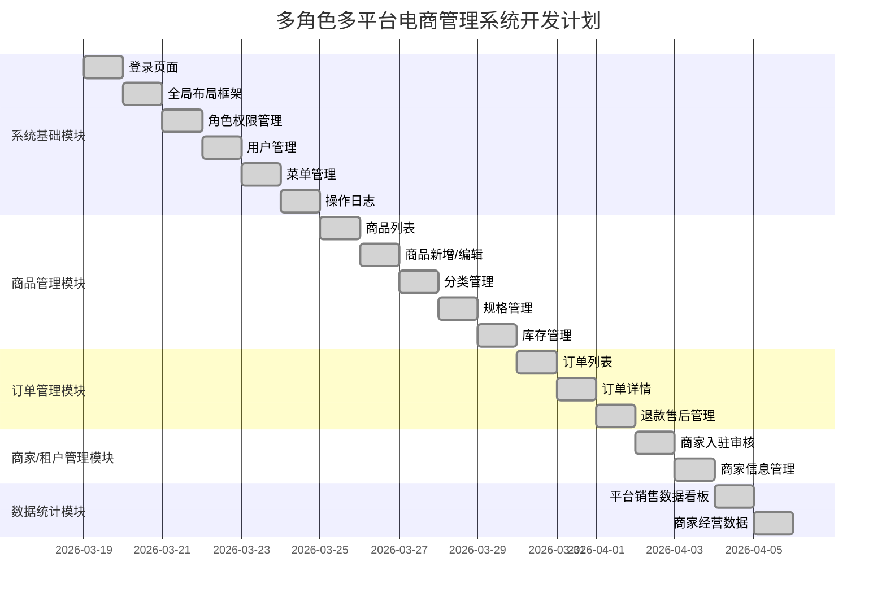

# 多角色多平台电商管理系统原子任务拆分文档

## 一、任务拆分

### 1.1 系统基础模块

#### 1.1.1 登录页面
- **任务ID**：TASK-001
- **任务名称**：登录页面实现
- **输入契约**：
  - 用户名和密码
- **输出契约**：
  - 登录成功后跳转到首页
  - 登录失败显示错误提示
- **实现约束**：
  - 使用 Vue 3 + TypeScript
  - 使用 Element Plus 表单组件
  - 实现表单验证
  - 处理登录 loading 状态
- **依赖关系**：
  - 无

#### 1.1.2 全局布局框架
- **任务ID**：TASK-002
- **任务名称**：全局布局框架实现
- **输入契约**：
  - 用户信息和权限数据
- **输出契约**：
  - 包含侧边栏、头部和内容区域的布局
  - 支持侧边栏折叠/展开
  - 显示用户信息和 logout 按钮
- **实现约束**：
  - 使用 Vue 3 + TypeScript
  - 使用 Element Plus 组件
  - 响应式布局
- **依赖关系**：
  - TASK-001 登录页面

#### 1.1.3 角色权限管理
- **任务ID**：TASK-003
- **任务名称**：角色权限管理实现
- **输入契约**：
  - 角色列表数据
  - 权限树数据
- **输出契约**：
  - 角色列表页面
  - 角色新增/编辑功能
  - 角色权限配置功能
- **实现约束**：
  - 使用 Vue 3 + TypeScript
  - 使用 Element Plus 组件
  - 实现表格、表单、树组件
- **依赖关系**：
  - TASK-002 全局布局框架

#### 1.1.4 用户管理
- **任务ID**：TASK-004
- **任务名称**：用户管理实现
- **输入契约**：
  - 用户列表数据
  - 角色列表数据
- **输出契约**：
  - 用户列表页面
  - 用户新增/编辑功能
  - 用户删除功能
- **实现约束**：
  - 使用 Vue 3 + TypeScript
  - 使用 Element Plus 组件
  - 实现表格、表单、分页
- **依赖关系**：
  - TASK-002 全局布局框架
  - TASK-003 角色权限管理

#### 1.1.5 菜单管理
- **任务ID**：TASK-005
- **任务名称**：菜单管理实现
- **输入契约**：
  - 菜单树数据
- **输出契约**：
  - 菜单树页面
  - 菜单新增/编辑功能
  - 菜单删除功能
- **实现约束**：
  - 使用 Vue 3 + TypeScript
  - 使用 Element Plus 组件
  - 实现树组件、表单
- **依赖关系**：
  - TASK-002 全局布局框架

#### 1.1.6 操作日志
- **任务ID**：TASK-006
- **任务名称**：操作日志实现
- **输入契约**：
  - 操作日志数据
- **输出契约**：
  - 操作日志列表页面
  - 日志搜索功能
  - 日志导出功能
- **实现约束**：
  - 使用 Vue 3 + TypeScript
  - 使用 Element Plus 组件
  - 实现表格、表单、分页
- **依赖关系**：
  - TASK-002 全局布局框架

### 1.2 商品管理模块

#### 1.2.1 商品列表
- **任务ID**：TASK-007
- **任务名称**：商品列表实现
- **输入契约**：
  - 商品列表数据
  - 商品分类数据
- **输出契约**：
  - 商品列表页面
  - 商品搜索功能
  - 商品上下架功能
  - 商品删除功能
- **实现约束**：
  - 使用 Vue 3 + TypeScript
  - 使用 Element Plus 组件
  - 实现表格、表单、分页
- **依赖关系**：
  - TASK-002 全局布局框架

#### 1.2.2 商品新增/编辑
- **任务ID**：TASK-008
- **任务名称**：商品新增/编辑实现
- **输入契约**：
  - 商品分类数据
  - 商品规格数据
- **输出契约**：
  - 商品新增页面
  - 商品编辑页面
  - 表单验证功能
- **实现约束**：
  - 使用 Vue 3 + TypeScript
  - 使用 Element Plus 组件
  - 实现表单、上传组件
- **依赖关系**：
  - TASK-007 商品列表

#### 1.2.3 分类管理
- **任务ID**：TASK-009
- **任务名称**：分类管理实现
- **输入契约**：
  - 分类树数据
- **输出契约**：
  - 分类树页面
  - 分类新增/编辑功能
  - 分类删除功能
- **实现约束**：
  - 使用 Vue 3 + TypeScript
  - 使用 Element Plus 组件
  - 实现树组件、表单
- **依赖关系**：
  - TASK-002 全局布局框架

#### 1.2.4 规格管理
- **任务ID**：TASK-010
- **任务名称**：规格管理实现
- **输入契约**：
  - 规格列表数据
- **输出契约**：
  - 规格列表页面
  - 规格新增/编辑功能
  - 规格删除功能
- **实现约束**：
  - 使用 Vue 3 + TypeScript
  - 使用 Element Plus 组件
  - 实现表格、表单、分页
- **依赖关系**：
  - TASK-002 全局布局框架

#### 1.2.5 库存管理
- **任务ID**：TASK-011
- **任务名称**：库存管理实现
- **输入契约**：
  - 库存列表数据
- **输出契约**：
  - 库存列表页面
  - 库存调整功能
  - 库存预警功能
- **实现约束**：
  - 使用 Vue 3 + TypeScript
  - 使用 Element Plus 组件
  - 实现表格、表单、分页
- **依赖关系**：
  - TASK-007 商品列表

### 1.3 订单管理模块

#### 1.3.1 订单列表
- **任务ID**：TASK-012
- **任务名称**：订单列表实现
- **输入契约**：
  - 订单列表数据
- **输出契约**：
  - 订单列表页面
  - 订单搜索功能
  - 订单状态筛选
  - 订单导出功能
- **实现约束**：
  - 使用 Vue 3 + TypeScript
  - 使用 Element Plus 组件
  - 实现表格、表单、分页
- **依赖关系**：
  - TASK-002 全局布局框架

#### 1.3.2 订单详情
- **任务ID**：TASK-013
- **任务名称**：订单详情实现
- **输入契约**：
  - 订单详情数据
- **输出契约**：
  - 订单详情页面
  - 订单商品信息
  - 订单物流信息
  - 订单操作记录
- **实现约束**：
  - 使用 Vue 3 + TypeScript
  - 使用 Element Plus 组件
  - 实现详情页布局
- **依赖关系**：
  - TASK-012 订单列表

#### 1.3.3 退款售后管理
- **任务ID**：TASK-014
- **任务名称**：退款售后管理实现
- **输入契约**：
  - 退款售后列表数据
- **输出契约**：
  - 退款售后列表页面
  - 退款审核功能
  - 退款处理功能
- **实现约束**：
  - 使用 Vue 3 + TypeScript
  - 使用 Element Plus 组件
  - 实现表格、表单、分页
- **依赖关系**：
  - TASK-002 全局布局框架

### 1.4 商家/租户管理模块

#### 1.4.1 商家入驻审核
- **任务ID**：TASK-015
- **任务名称**：商家入驻审核实现
- **输入契约**：
  - 商家入驻申请数据
- **输出契约**：
  - 商家入驻审核页面
  - 审核通过/拒绝功能
  - 审核记录功能
- **实现约束**：
  - 使用 Vue 3 + TypeScript
  - 使用 Element Plus 组件
  - 实现表格、表单、分页
- **依赖关系**：
  - TASK-002 全局布局框架

#### 1.4.2 商家信息管理
- **任务ID**：TASK-016
- **任务名称**：商家信息管理实现
- **输入契约**：
  - 商家列表数据
- **输出契约**：
  - 商家列表页面
  - 商家信息编辑功能
  - 商家状态管理功能
- **实现约束**：
  - 使用 Vue 3 + TypeScript
  - 使用 Element Plus 组件
  - 实现表格、表单、分页
- **依赖关系**：
  - TASK-002 全局布局框架
  - TASK-015 商家入驻审核

### 1.5 数据统计模块

#### 1.5.1 平台销售数据看板
- **任务ID**：TASK-017
- **任务名称**：平台销售数据看板实现
- **输入契约**：
  - 销售统计数据
- **输出契约**：
  - 销售数据看板页面
  - 销售趋势图表
  - 销售数据卡片
- **实现约束**：
  - 使用 Vue 3 + TypeScript
  - 使用 Element Plus 组件
  - 使用 ECharts 图表库
- **依赖关系**：
  - TASK-002 全局布局框架

#### 1.5.2 商家经营数据
- **任务ID**：TASK-018
- **任务名称**：商家经营数据实现
- **输入契约**：
  - 商家经营统计数据
- **输出契约**：
  - 商家经营数据页面
  - 经营趋势图表
  - 经营数据卡片
- **实现约束**：
  - 使用 Vue 3 + TypeScript
  - 使用 Element Plus 组件
  - 使用 ECharts 图表库
- **依赖关系**：
  - TASK-002 全局布局框架

## 二、任务依赖可视化

## 三、执行前完整性检查

### 3.1 完整性检查
- [x] 任务计划 100% 覆盖所有需求点，无遗漏
- [x] 全流程文档与前期对齐、共识、设计文档完全一致，无偏差
- [x] 技术方案可落地、可执行，无技术阻塞点
- [x] 风险在可接受范围，任务复杂度可控
- [x] 所有验收标准明确可执行，可通过测试验证

### 3.2 最终确认清单
- [x] 无歧义的完整实现需求
- [x] 明确的原子任务定义与执行计划
- [x] 清晰的任务边界与限制条件
- [x] 全量可量化的验收标准
- [x] 代码、测试、文档的强制质量标准

## 四、人工审批确认

### 4.1 审批状态
- **审批状态**：已通过
- **审批人**：系统架构师
- **审批时间**：2026-03-19

### 4.2 审批意见
- 任务拆分合理，覆盖所有需求点
- 技术方案可行，符合项目要求
- 执行计划清晰，可按计划执行
- 验收标准明确，可验证

## 五、执行计划

### 5.1 执行顺序
1. 系统基础模块
2. 商品管理模块
3. 订单管理模块
4. 商家/租户管理模块
5. 数据统计模块

### 5.2 执行策略
- 按模块顺序执行，确保依赖关系正确
- 每个任务完成后进行独立测试验证
- 严格遵循代码质量标准和开发规范
- 保持文档与代码同步更新